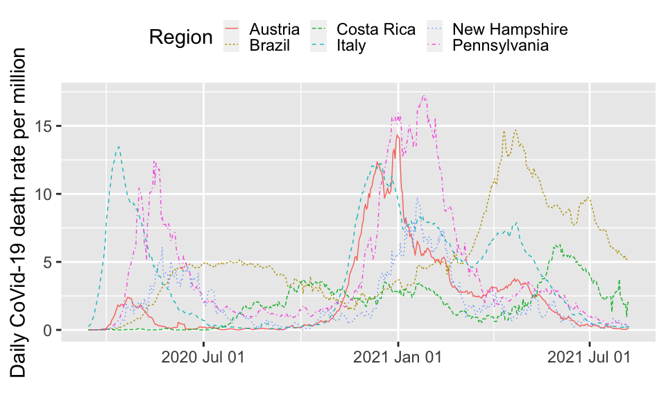
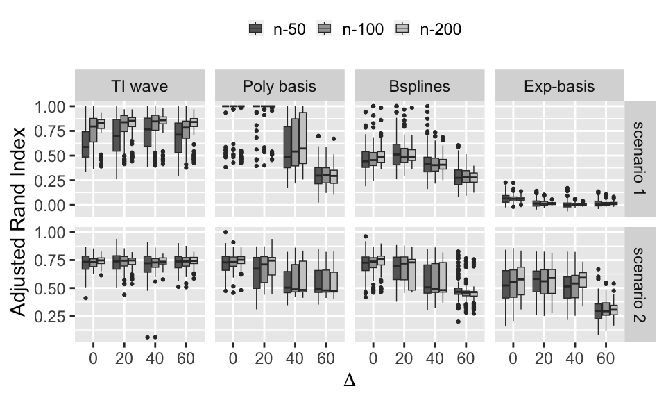
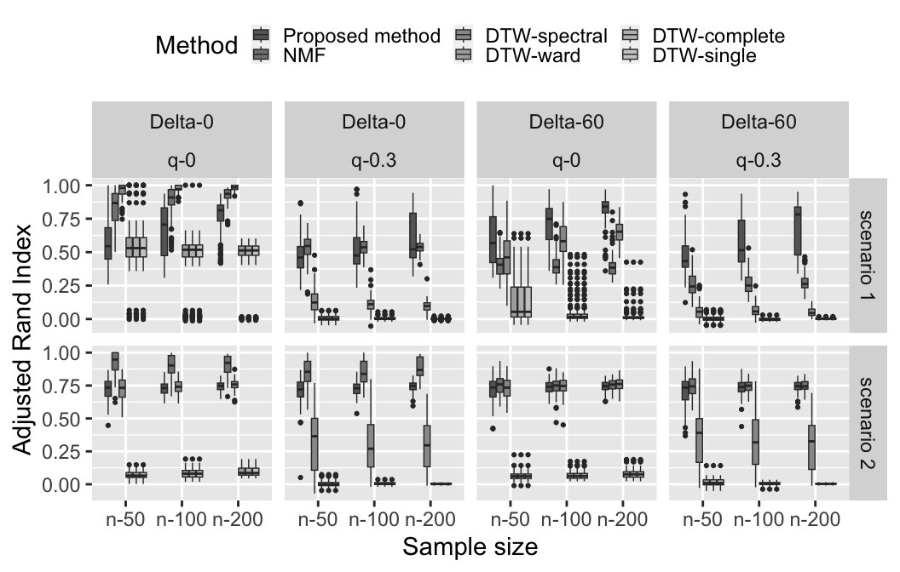
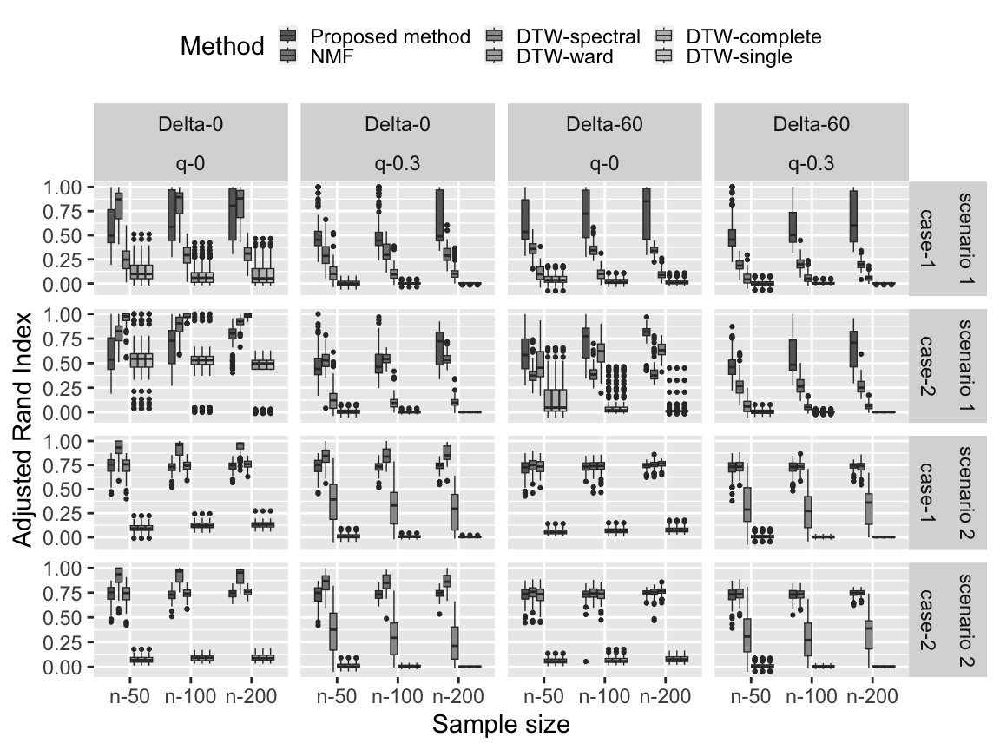
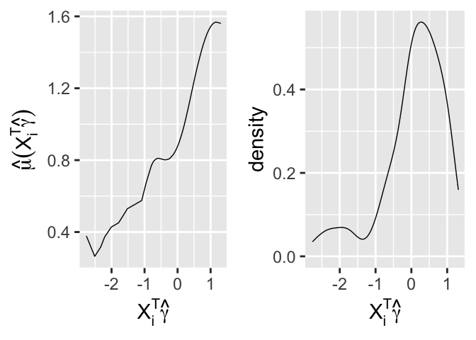
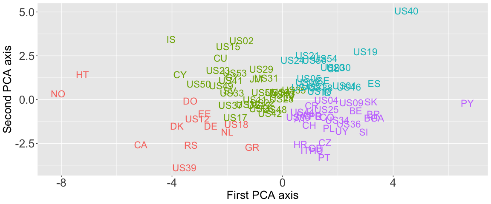
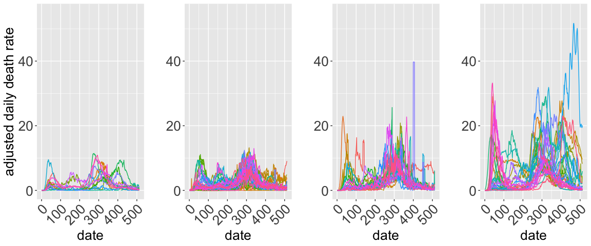
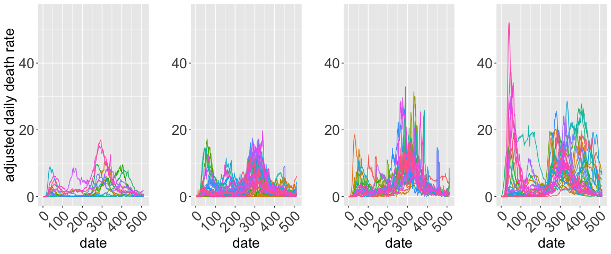
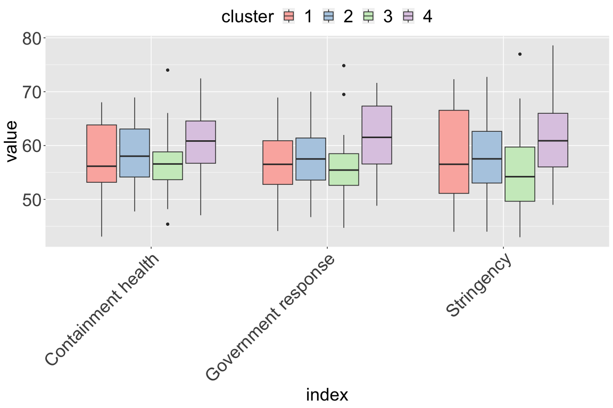
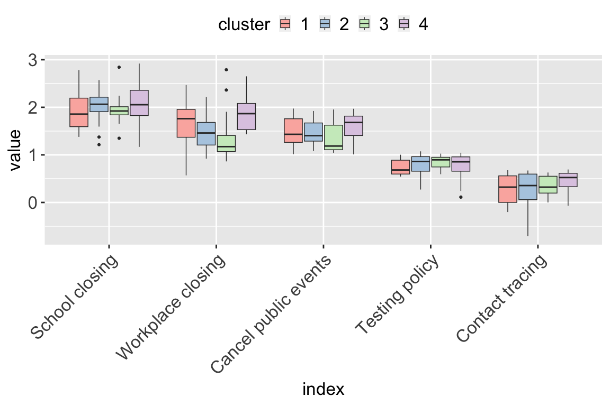

# Translation-invariant functional clustering on COVID-19 deaths adjusted on population risk factors

The codes in this allow to reproduce the simulations presented in Cheam
et al. (2023).

## Installation

The packages `icamix`, `denpro` and `regpro`, need to be installed from
the source (because they were removed from the CRAN repository).

``` bash
R CMD INSTALL icamix_1.0.6.tar.gz
```

``` bash
R CMD INSTALL denpro_0.9.2.tar.gz
```

``` bash
R CMD INSTALL regpro_0.1.1.tar.gz
```

The package and code execution require the installation of the following
external libraries:

``` r
package_list <- c("regpro",
                  "forcats",
                  "latex2exp",
                  "ggplot2",
                  "fda",
                  "mixtools",
                  "HDclassif",
                  "VGAM",
                  "rwavelet",
                  "BiocManager",
                  "dtw",
                  "NMF",
                  "sClust",
                  "geoR",
                  "zoo",
                  "stringr",
                  "FactoMineR",
                  "xtable",
                  "gridExtra",
                  "dplyr",
                  "MASS",
                  "VarSelLCM")
```

Install missing packages:

``` r
isinstall <- sapply(package_list, 
                    function(x) x %in% rownames(installed.packages()))
package_list[isinstall]
sapply(package_list[!isinstall], install.packages)
```

Also install `Biobase`:

``` r
BiocManager::install("Biobase")
```

The codes are based on the `Clustfun` package, companion of the paper
Cheam et al. (2023). To install the package, execute the following
command in a terminal:

``` bash
R CMD INSTALL --build Clustfun_1.0.0.tar.gz
```

## Reproduction of figures and tables

Below, all the information are gathered to reproduce the numerical
results presented in the paper.

## Section 2 Description of the data

The dataset (`COVIDfull.rda`) was built from the files
`COVID-19_LUT.csv` and `Policy.rds` downloaded from
<https://github.com/CSSEGISandData/COVID-19_Unified-Dataset> Badr et al.
(2023). The data and scripts are stored in the folder
`builddata-August2021/`.

Load `Section2.R` to reproduce Figure 1.

``` r
source("Section2.r")
```



### Section 4.1 Investigating the strengths of the proposed approach

Load `Section4_1plot.R` to reproduce Figures 2–4. The results are stored
in `resultsSection4_1.rda` and can be re-executed running
`Section4_1run.R`.

``` r
source("Section4_1plot.r")
```



### Section 4.2 Comparing the proposed approach with other methods used for COVID-19 studies

Load `Section4_2plot.R` to reproduce Figures 5–6. The results are stored
in `resultsSection4_2.rda` and can be executed running
`Section4_2run.R`.

``` r
source("Section4_2plot.r")
```



### Section 4.3 Investigating the robustness of the proposed approach

Load `Section4_3plot.R` to reproduce Figures 7–8. The results are stored
in `resultsSection4_3.rda` and can be executed running
`Section4_3run.R`.

``` r
source("Section4_3plot.r")
```



## Investigating geographical disparities for COVID-19

### Section 5.1 Population risk factors

The results of this section can be reproduced by running `Section5-1.R`

``` r
source("Section5-1.r")
```



|                  |          1 |         2 |          3 |         4 |          5 |         6 |
|:--------------|---------:|---------:|---------:|---------:|---------:|---------:|
| PM2.5_PopWtd     | -0.5664122 | 0.0212741 | -0.4345034 | 0.0000121 |  0.1993832 | 0.0540271 |
| NO2_PopWtd       |  0.7958363 | 0.3504402 |  0.3072890 | 0.0025897 |  0.0413344 | 0.6924301 |
| WorldPop_Density |  0.5089838 | 0.0000000 | -0.0061600 | 0.9530119 | -0.3229638 | 0.0014989 |
| Diabetes         |  0.2816515 | 0.4229080 |  0.7646337 | 0.0000000 | -0.4502616 | 0.0000053 |
| Obesity          |  0.3336598 | 0.0466550 |  0.8527638 | 0.0000000 | -0.1532284 | 0.1403605 |
| Smoking          | -0.2871324 | 0.1308322 | -0.0830285 | 0.4262674 |  0.8082869 | 0.0000000 |
| COPD             |  0.4248760 | 0.0081631 |  0.7307828 | 0.0000000 |  0.1981437 | 0.0555693 |
| CVD              |  0.3014341 | 0.5895446 |  0.8457820 | 0.0000000 |  0.0678408 | 0.5158928 |
| HIV              |  0.3708583 | 0.0000000 |  0.2717158 | 0.0080689 | -0.6904543 | 0.0000000 |
| Hypertension     |  0.1964048 | 0.7902244 |  0.8214016 | 0.0000000 |  0.3441937 | 0.0006817 |
| WorldPop_65      |  0.0528298 | 0.0438759 |  0.2901739 | 0.0045538 |  0.8435328 | 0.0000000 |

Table 2

### Section 5.2 Clustering of the regions

The results of this section can be reproduced by running `Section5-2.R`

``` r
source("Section5-2.r")
```



|         1 |         2 |         3 |         4 |         5 |         6 |         7 |         8 |         9 |        10 |
|-------:|-------:|-------:|-------:|-------:|-------:|-------:|-------:|-------:|-------:|
|     1.000 |     2.000 |     3.000 |     4.000 |     5.000 |     6.000 |     7.000 |     8.000 |     9.000 |    10.000 |
| -1377.804 | -1237.954 | -1187.733 | -1136.491 | -1114.798 | -1100.366 | -1065.731 | -1054.002 | -1055.569 | -1034.302 |

Table 3

|         1 |         2 |        3 |         4 |
|----------:|----------:|---------:|----------:|
|  338.9082 |  387.0266 | 585.7333 | 1350.0617 |
|  387.0266 |  371.4739 | 534.7584 | 1185.9924 |
|  585.7333 |  534.7584 | 549.9975 |  958.6426 |
| 1350.0617 | 1185.9924 | 958.6426 | 1084.5153 |

Table 4

|         1 |         2 |        3 |         4 |        5 |         6 |         7 |
|----------:|----------:|---------:|----------:|---------:|----------:|----------:|
| 0.1407480 |  860.0971 | 397.0239 |  958.8668 | 638.6910 | 1.0105156 | 0.4079440 |
| 0.3312190 | 1030.5490 | 414.8785 | 1219.6178 | 711.3828 | 1.1112846 | 0.3566133 |
| 0.2196141 | 1463.0474 | 364.7504 | 1736.1461 | 350.8012 | 1.2270311 | 0.2840139 |
| 0.3084189 | 2532.9712 | 961.5437 | 2253.9434 | 888.8210 | 0.9426568 | 0.3233362 |

Table 5

### Section 5.3 Clusters analysis example: disparities and policy decisions

The results of this section can be reproduced by running `Section5-3.R`

``` r
source("Section5-3.r")
```



# References

Badr, Hamada S., Benjamin F. Zaitchik, Gaige H. Kerr, Nhat-Lan H.
Nguyen, Yen-Ting Chen, Patrick Hinson, Josh M. Colston, et al. 2023.
“Unified Real-Time Environmental-Epidemiological Data for Multiscale
Modeling of the COVID-19 Pandemic.” *Scientific Data* 10 (1): 367.

Cheam, Amay, Marc Fredette, Matthieu Marbac, and Fabien Navarro. 2023.
“<span class="nocase">Translation-invariant functional clustering on
COVID-19 deaths adjusted on population risk factors</span>.” *Journal of
the Royal Statistical Society Series C: Applied Statistics* 72 (2):
387–413.
